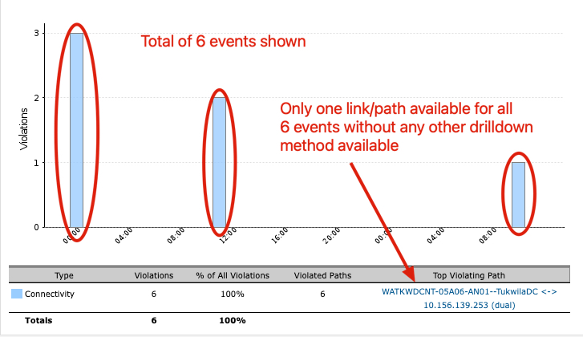

Scott Bulger
Rakesh Saraf
Daniel Cowden
Mike Wiland - not in attendance

Scott expressed his interest in a new report/dashboard/webpage, that presented multiple network delivery paths metrics within a page.

We reviewed saved lists and Scott has a better understanding of how they work, what their limitations are and where they can provide value.

We also look at several reports, but were unable to isolate the event he saw from the initial "Violations by Type - Past 24 hours" graph.  There wasn't any way to drill down past the one connectivity event show in the .

We were unable to view connectivity events within the Route Visualization tool I believe that the connectivity events were too brief and therefore not captured.

Opened [https://appneta.atlassian.net/browse/AFE-1141](JIRA AFE-1141) to address Scott desire for a network path comparison tool.
